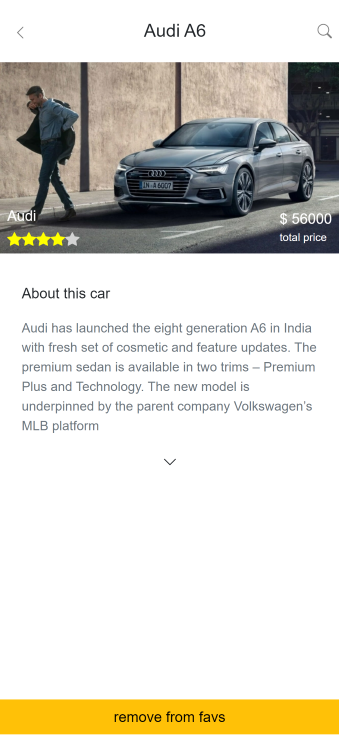

# Car Bookmarks (Frontend)

A Car bookmarking site with authentication madw with React.
User can signin and signup. Access cars and add and remove them from their favourites
and also exclusively browse favourites.

## Preview

## Libraries used

- redux
- react-router-dom
- bootstrap
- react-query
- react-multi-carousel
- axios

## Live demo

[Click here](https://awesome-tesla-2329da.netlify.app/)

## Getting Started

- Clone the repo `https://github.com/iam-Akshat/final-front.git`
- `cd` into the project
- Run `npm install` to install all the dependencies
- Run `npm start`

## Deployment
 This is uploaded on Netlify. Check out Netlify for how to deploy your own version.

## Testing
Uses default create-react-app testing libraries
- redux-mock-store for mocking store
- history when testing react-router-dom related functionalities

## Authors

👤 **Akshat Sethi**

- Github: [iam-Akshat](https://github.com/iam-Akshat)
- Twitter: [Akshat Sethi](https://twitter.com/akshatsethi)
- LinkedIn: [Akshat Sethi](https://linkedin.com/in/akshatsethi)

## Contributing

- Fork the project
- Create your feature branch `git checkout -b awesome-feature`
- Commit your changes `git commit -m 'Awesome feature'`
- Push it `git push -u origin awesome-feature`
- Open a pull request using this branch

## Acknowledgements
- [Microverse](https://www.notion.so/Final-Capstone-Project-Find-Your-House-9a424802e7dc48eb8ef40e2ac09397d1#b2e5bb2a2369412a8ee0f270706043e9)
## Show your support

Give a ⭐️ if you like this project!
